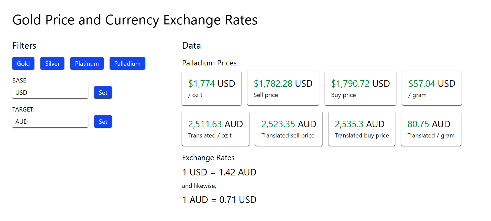

# Gold Price and Currency Exchange Rates Tracker


## Table of Contents
1. [Installation](#installation)
2. [Usage](#usage)
3. [Tech Stack](#tech-stack)
4. [License](#license)

## Installation
```
git clone https://github.com/logicalPanda2/metal-currency-tracker.git
```

## Usage
0. Navigate to the root directory: `cd metal-currency-tracker`
1. Install the dependencies: `npm install` OR `bun install`
2. Configure the environment variables according to `.env.example`
3. Adjust the type definitions according to `api.example.d.ts`
4. Run: `npm run dev` OR `bun dev`
5. Then open `localhost:3000` to visit the site

## Tech Stack
1. React with Next.js
2. Tailwind CSS
3. TypeScript

## License
<a href="./LICENSE.txt">MIT License</a>
